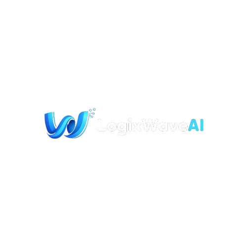

  
  
  # 🌊 LogixWaveAI
  ### *Architecting the Future with Intelligence & Code*

  

    <b>Gen AI & RAG Systems • Full-Stack Web • Mobile Apps • Cloud & DevOps • Cyber Security</b>
  

  
  
  

---

### 🚀 **Who We Are**

**LogixWaveAI** is a next-generation technology agency based in **Surat, India**. We are not just developers; we are **Digital Architects**. We combine the power of traditional software engineering with cutting-edge **Generative AI** to build scalable, future-proof solutions.

> 💡 **"From Concept to Cloud."** — Whether it's a sleek Mobile App, a complex Enterprise Platform in .NET, or an Autonomous AI Agent using LangGraph, we build it all.

---

### 🛠 **Our 360° Tech Arsenal**

We use the industry's most robust tools. **Old school reliability meets new school AI.**

| **Domain** | **Technologies** |
| :--- | :--- |
| **Languages** |      |
| **Frontend** |     |
| **Backend** |     |
| **AI & GenAI** |      |
| **Mobile** |   |
| **Database** |   |
| **DevOps / Cloud** |     |
| **Design** |   |

---

  <h3>Ready to scale your business with AI?</h3>
  
🚀 <b>Let's build something extraordinary together.</b>

  
📧 <a href="mailto:contact@logixwaveai.com">contact@logixwaveai.com</a>

  
© 2026 LogixWaveAI LLP. All Rights Reserved.

